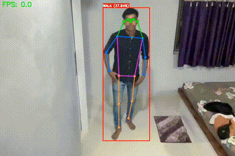
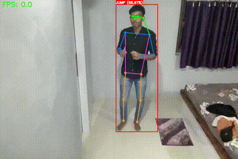
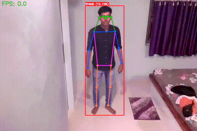

# Human Action Detection for Multi Person

## Project Overview

This project implements a real-time multi-person pose classification system using Yolov11 for pose detection and a custom LSTM-based neural network for action classification. The application can process both video files and live webcam streams, detecting and classifying human actions based on pose keypoints.

## Features

- Real-time multi-person pose detection

- Action classification using LSTM neural network

- Webcam and video file support

- Visualizes detection results with:

  - Bounding boxes

  - Action labels

  - Confidence probabilities

  - Real-time FPS display

## Prerequisites

- Python 3.8+

- OpenCV

- PyTorch

- NumPy

- scikit-learn

- Ultralytics Yolov11

## Installation

1. Clone the repository:

```bash

git clone https:(https://github.com/Jass31/Human-Action-Detection-for-Multi-Person-.git)


```

2. Create a virtual environment:

```bash

python -m venv venv

source venv/bin/activate  # On Windows, use venv\Scripts\activate

```

3. Install dependencies:

```bash

pip install -r Requirements.txt

```

## Project Structure

```

project-root/

│

├── src/

│   ├── detection_keypoint.py         # Yolov11 pose detection module

│   └── classification_keypoint.py     # LSTM-based classification module

│

├── datasets/

│   ├── train_action_pose_keypoint.csv # Training data

│   └── test_action_pose_keypoint.csv # Testing data

│

├── models/

│   └── HAAD_Pose_Angle.pt             # Trained model weights

│

├── notebook/

│   ├── generate_dataset.ipynb                         # Genrating Dataset using This Notebook

│   └── train_keypoint_classification.ipynb            # Train Model using This Notebook

│   └── test_inference_model.ipynb                     # Testing Inference using This Notebook

└── README.md

```

## Model Training

### Data Preparation

1. Collect pose keypoint data

2. Prepare CSV with columns:

   - Keypoints (x, y coordinates)

   - Label (action class)

### Training Steps

1. Extract keypoints from training videos

2. Convert keypoints to angular features

3. Train LSTM model using extracted features

## Customization

- Modify src/classification_keypoint.py to adjust model architecture

- Update datasets/train_action_pose_keypoint.csv with your custom action classes

## Performance Metrics

- Real-time processing

- Multi-person detection

- Action classification with confidence

## Known Limitations

- Performance depends on training data quality

- Requires clear, unobstructed view of subjects

- Limited by model's training dataset

## Demo

Here are sample action classification results from our multi-person pose detection system:
<table>
  <tr>
    <td align="center">
      <strong>Walking Action</strong><br>
      
    </td>
    <td align="center">
      <strong>Punching Action</strong><br>
      
    </td>
  </tr>
  <tr>
    <td align="center">
      <strong>Jumping Action</strong><br>
      
    </td>
    <td align="center">
      <strong>Kicking Action</strong><br>
      
    </td>
  </tr>
</table>

## Acknowledgments

- Ultralytics Yolov11

- PyTorch

- OpenCV Community

## Contact

[Jash Tandel] - [jashswayam@gmail.com]
